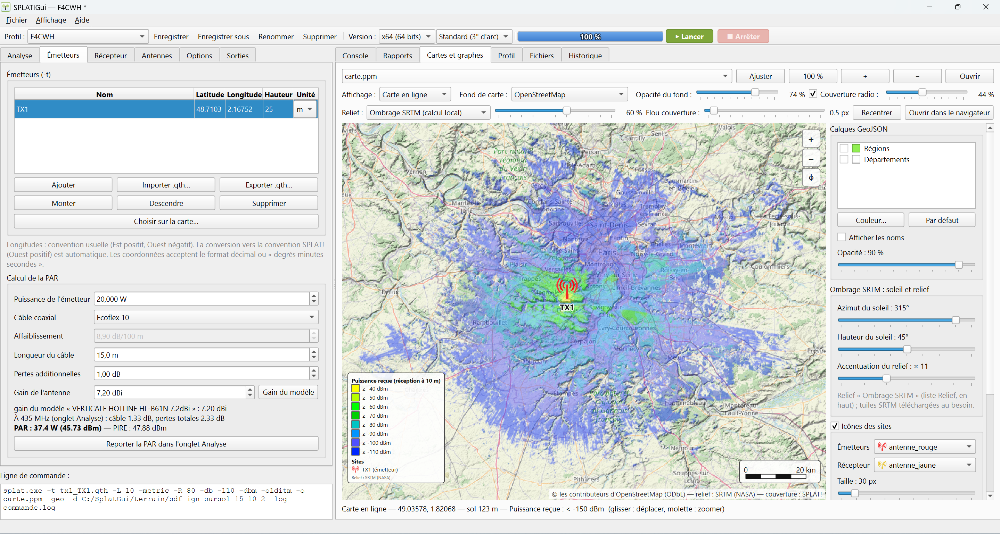

# SPLAT!Gui

Interface graphique Windows pour **[SPLAT!](https://www.qsl.net/kd2bd/splat.html)** (*Signal Propagation, Loss, And Terrain*), l'outil d'analyse de propagation radio et de relief de John A. Magliacane, KD2BD, pour les fréquences de 20 MHz à 20 GHz.

NB: cette interface a été développée avec l'aide de l'IA "Claude".

SPLAT!Gui prépare les fichiers d'entrée de SPLAT! (sites `.qth`, paramètres ITM `.lrp`, diagrammes d'antenne `.az` / `.el`). Il télécharge et convertit le relief SRTM, lance le calcul, puis affiche les rapports et les cartes de couverture, y compris sur un fond OpenStreetMap ou IGN.

Code source : <https://github.com/F4CWH/SplatGui>



## Fonctionnalités

- **Modes d'analyse** : point à point (`-t` / `-r`), couverture en visibilité (`-c`), perte de trajet et champ (`-L`), jusqu'à 30 émetteurs ; versions x64 / x86, standard et HD.
- **Sites** : tableau des émetteurs, récepteur, import / export `.qth`, coordonnées décimales ou en degrés-minutes-secondes, placement sur une carte OSM / IGN avec recherche d'adresse.
- **Antennes** :
  - bibliothèque de diagrammes de rayonnement (MSI / Planet, sortie NEC-2 / 4nec2, EZNEC, SPLAT! `.az` / `.el`, texte / CSV) ;
  - pour chaque émetteur : modèle, azimut, inclinaison et diagrammes orientés.
- **Calcul de la PAR** :
  - puissance, câble coaxial (RG-58, RG-213, H155, Aircell 7, Ecoflex, LMR…, affaiblissement interpolé à la fréquence de calcul) ou valeur personnalisée, longueur, pertes additionnelles ;
  - gain repris du modèle d'antenne, toujours modifiable ;
  - résultat reporté dans les paramètres ITM.
- **Propagation** : paramètres ITM / ITWOM, préréglages de sol, climats radio, polarisation.
- **Relief** :
  - téléchargement automatique des tuiles manquantes et conversion en SDF, puis relance de SPLAT! si des tuiles manquaient ;
  - trois sources au choix : SRTM, Copernicus GLO-30 (mondial, plus récent) ou IGN RGE ALTO (France, sol nu, complété par Copernicus hors de France) ;
  - conversion de ses propres tuiles DTED (.dt0, .dt1, .dt2 ; fichiers ou dossier entier) en SDF standard ou HD ;
  - sursol facultatif (arbres, bâti, arbustes) d'après l'occupation du sol ESA WorldCover, retiré à l'emplacement des sites pour que les hauteurs d'antenne restent comptées depuis le sol.
- **Profil de liaison** (point à point) : relief, courbure terrestre, ligne de visée, première zone de Fresnel et 60 %, dégagement et obstacles, tracés par l'application (valeurs au survol, export PNG).
- **Cartes** :
  - image composée (fond de carte, ombrage du relief, couverture, calques GeoJSON, icônes des sites, légende, échelle, nord, proportions corrigées) ;
  - ou carte en ligne interactive ;
  - export PNG / PPM géoréférencé ou en page web Leaflet.
- **Profils et historique** : paramètres enregistrés par profil, historique des calculs rechargeable.
- **Interface** : français, anglais et espagnol ; thèmes Système, Clair, Sombre, Bleu nuit, Sépia et Contraste élevé.
- **Pré-requis** : vérification à chaque démarrage. Téléchargement des DLL nécessaires à SPLAT! (MSYS2 pour x64, MinGW pour x86) et de gnuplot, et installation des exécutables SPLAT! depuis une archive, locale ou en ligne.

## Installation

Téléchargez l'installeur `SPLAT!Gui-Setup-<version>.exe` et lancez-le. L'installation se fait par utilisateur (`%LOCALAPPDATA%\Programs\SPLAT!Gui`), sans droits administrateur. L'assistant permet de choisir :

- le dossier des **résultats** des calculs (`runs`) ;
- le dossier des **sites** (`qth`) ;
- le dossier des **paramètres ITM** (`lrp`).

Ces dossiers restent modifiables dans **Fichier → Réglages**.

### SPLAT!, ses DLL et gnuplot

SPLAT! n'est distribué qu'en code source : SPLAT!Gui ne contient pas ses exécutables Windows. Au premier démarrage, l'application propose la fenêtre **Fichier → Pré-requis (SPLAT!, DLL, gnuplot)…**, qui permet :

- d'installer `splat.exe`, `splat-hd.exe` et les utilitaires (`srtm2sdf`…) depuis une archive `.zip` / `.tar.*`, locale ou en ligne. L'architecture x64 / x86 de chaque exécutable est détectée automatiquement ;
- de télécharger les DLL d'exécution :
  - **x64** : `msys-2.0.dll`, `msys-stdc++-6.dll`, etc., depuis le dépôt MSYS2, avec vérification SHA-256 ;
  - **x86** : `libstdc++-6.dll`, `libgcc_s_dw2-1.dll`, `libbz2-2.dll`, `zlib1.dll`, depuis MinGW.org et MSYS2 ;
- de télécharger **gnuplot** 6.0.3 (distribution Windows 64 bits officielle, avec vérification SHA-256). Il est facultatif : il ne sert qu'aux graphes produits par SPLAT! (`-p`, `-e`, `-h`, `-H`, `-l`), le profil de liaison étant tracé par l'application. Il est installé dans `gnuplot\` et son dossier `bin` est ajouté au PATH des deux architectures. Un gnuplot déjà installé ailleurs peut aussi être ajouté au PATH dans **Fichier → Réglages**.

## Utilisation depuis les sources

Prérequis : Windows, **Python 3.14** ou plus récent (le téléchargement des DLL x64 utilise la décompression zstd intégrée à Python 3.14).

```powershell
python -m venv .venv
.venv\Scripts\pip install -r requirements.txt
.venv\Scripts\python main.py
```

## Compilation

L'exécutable est produit par [PyInstaller](https://pyinstaller.org) et l'installeur par [Inno Setup 6](https://jrsoftware.org/isinfo.php) (`winget install JRSoftware.InnoSetup`).

```powershell
.venv\Scripts\pip install pyinstaller
powershell -ExecutionPolicy Bypass -File installer\build_installer.ps1
```

Le script produit :

- `dist\SPLAT!Gui\` : l'application, avec `SPLAT!Gui.exe` et ses bibliothèques dans `lib\` ;
- `dist\SPLAT!Gui-Setup-<version>.exe` : l'installeur.

La version est lue dans `splatgui/__init__.py`. L'option `-SkipPyInstaller` reconstruit seulement l'installeur.

## Organisation des fichiers

Les données sont enregistrées à côté de l'exécutable (ou de `main.py`). Les chemins internes à ce dossier sont mémorisés en relatif : l'application peut être déplacée.

| Dossier / fichier | Contenu |
|---|---|
| `bin\x64`, `bin\x86` | exécutables SPLAT! et utilitaires |
| `deps\x64`, `deps\x86` | DLL téléchargées |
| `terrain\srtm`, `terrain\sdf`, `terrain\tiles` | tuiles SRTM, fichiers SDF, cache des fonds de carte |
| `terrain\copernicus`, `terrain\ign`, `terrain\worldcover` | relief Copernicus et IGN, occupation du sol (grilles compressées) |
| `terrain\sdf-<source>[-sursol-…]` | fichiers SDF de chaque configuration de relief (source, hauteurs du sursol) |
| `runs` | un dossier par calcul (fichiers d'entrée, rapports, cartes, `commande.cmd`) |
| `qth`, `lrp` | sites et paramètres ITM importés / exportés |
| `profiles`, `antennas` | profils et bibliothèque d'antennes |
| `geojson` | contours affichables en calques (communes, départements, régions) |
| `settings.json`, `history.json` | réglages et historique |

## Traductions

Le français est la langue source. Chaque autre langue est un catalogue JSON dans `splatgui/locales/` (`en.json`, `es.json`).

Pour ajouter une langue :

1. Créez son catalogue JSON dans `splatgui/locales/`.
2. Déclarez-la dans `LANGUAGES` (`splatgui/i18n.py`).
3. Vérifiez sa couverture :

```powershell
.venv\Scripts\python splatgui\locales\check.py --check en
```

## Licence

SPLAT! (John A. Magliacane, KD2BD) et SPLAT!Gui (F4CWH) sont des logiciels libres. Vous pouvez les redistribuer et/ou les modifier selon les termes de la **licence publique générale GNU (GNU GPL)** publiée par la Free Software Foundation, **version 2 ou (à votre choix) toute version ultérieure**. Le texte complet de la licence est dans [`LICENSE`](LICENSE).

Ces programmes sont distribués dans l'espoir qu'ils seront utiles, mais **sans aucune garantie**, sans même la garantie implicite de qualité marchande ou d'adéquation à un usage particulier.

Composants tiers :

- PyQt6 (GPL v3) ;
- NumPy (BSD) ;
- les DLL MSYS2 / MinGW, téléchargées à la demande (GPL avec exception d'exécution).

Les fonds de carte et données proviennent d'OpenStreetMap (ODbL), d'OpenTopoMap (CC-BY-SA), de l'IGN Géoplateforme et du relief SRTM de la NASA. Ils sont soumis à leurs propres conditions, rappelées en attribution sur les cartes.
